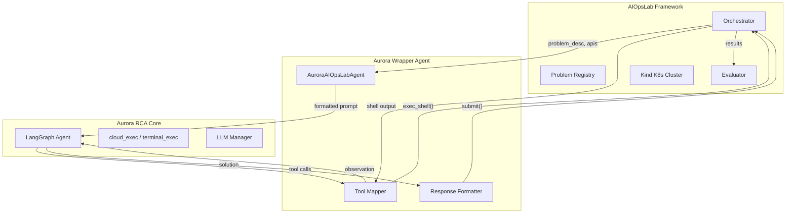

# Aurora AIOpsLab RCA Benchmark Integration

## Architecture




## Key Files to Create

### 1. Aurora Wrapper Agent

**File:** `AIOpsLab/clients/aurora_agent.py`

Wraps Aurora's agent to interface with AIOpsLab:

- Implements required `init_context()` and `get_action()` methods
- Maps AIOpsLab's shell-based actions to Aurora's tool format
- Converts Aurora's tool outputs back to AIOpsLab's expected response format

```python
class AuroraAIOpsLabAgent:
    async def get_action(self, input: str) -> str:
        # Call Aurora's agent, intercept tool calls
        # Format response as: ```\nexec_shell("kubectl ...")\n```
```

### 2. Tool Mapper

**File:** `AIOpsLab/clients/aurora_tool_mapper.py`

Translates between Aurora's tools and AIOpsLab's shell interface:

- `cloud_exec('gcp', 'kubectl get pods')` -> `exec_shell('kubectl get pods')`
- `terminal_exec('ls -la')` -> `exec_shell('ls -la')`
- Handles Aurora's structured tool responses

### 3. Benchmark Runner

**File:** `AIOpsLab/benchmark_aurora.py`

Script to run Aurora against AIOpsLab problems:

- Iterates through problem registry (or subset)
- Collects metrics: accuracy, time, tokens, steps
- Outputs comparison CSV/JSON

## Environment Setup

1. **Kind cluster** - Use existing AIOpsLab setup:
  ```bash
   kind create cluster --config kind/kind-config-x86.yaml
   cd aiopslab && cp config.yml.example config.yml
   # Set k8s_host: kind
  ```
2. **Aurora dependencies** - The wrapper needs access to Aurora's LLM infrastructure but NOT the full server (no DB, no Celery)

## Problems to Benchmark

Focus on **Analysis** tasks (RCA) from the registry:

- `k8s_target_port-misconfig-analysis-1/2/3`
- `auth_miss_mongodb-analysis-1`
- `revoke_auth_mongodb-analysis-1/2`
- `misconfig_app_hotel_res-analysis-1`
- `redeploy_without_PV-analysis-1`
- `wrong_bin_usage-analysis-1`

These require the agent to identify:

- `system_level`: Hardware / Operating System / Virtualization / Application
- `fault_type`: Misconfiguration / Code Defect / Authentication Issue / Network Issue / Operation Error / Dependency Problem

## Evaluation Metrics

From AIOpsLab's evaluators:

- **Accuracy**: Exact match on system_level and fault_type
- **TTA (Time to Analysis)**: Duration in seconds
- **Steps**: Number of tool calls
- **Tokens**: Input/output token count
- **LLM Judge Score** (optional): 1-10 reasoning quality

## Limitations

- Aurora's GitHub/cloud provider tools won't be available in Kind cluster
- Aurora Learn (similar past incidents) won't have relevant data
- Some Aurora tools (Splunk, Datadog, etc.) are not applicable

The benchmark measures Aurora's **core reasoning ability** on K8s troubleshooting, not its full feature set.