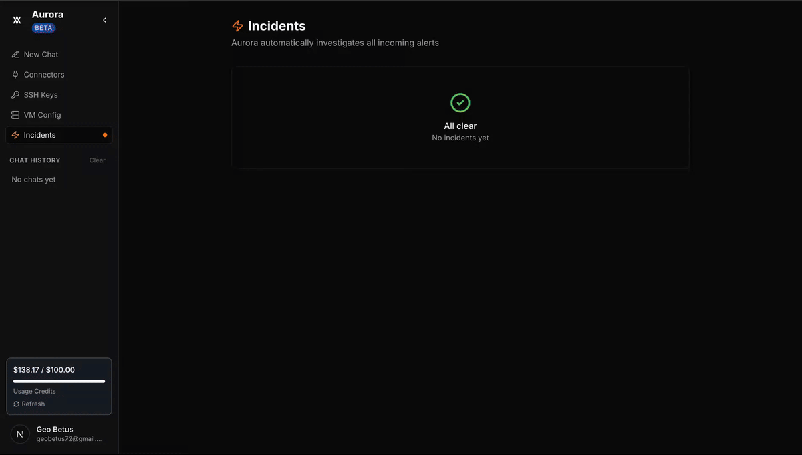
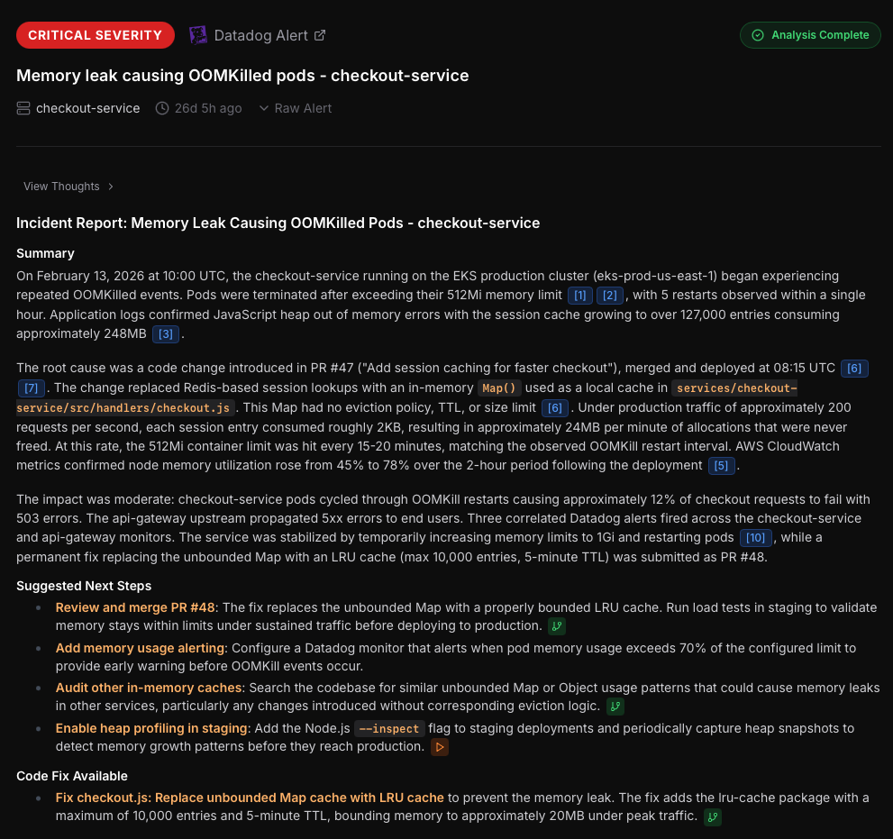
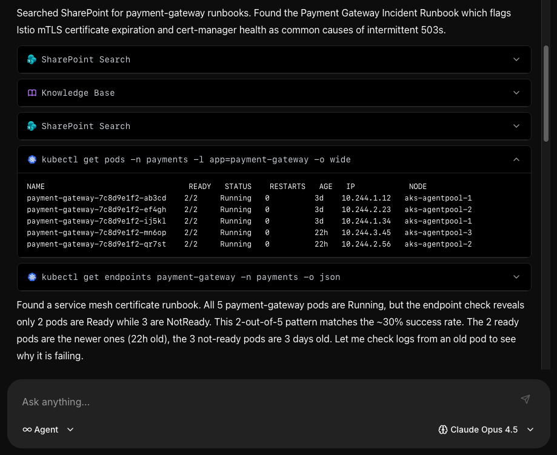
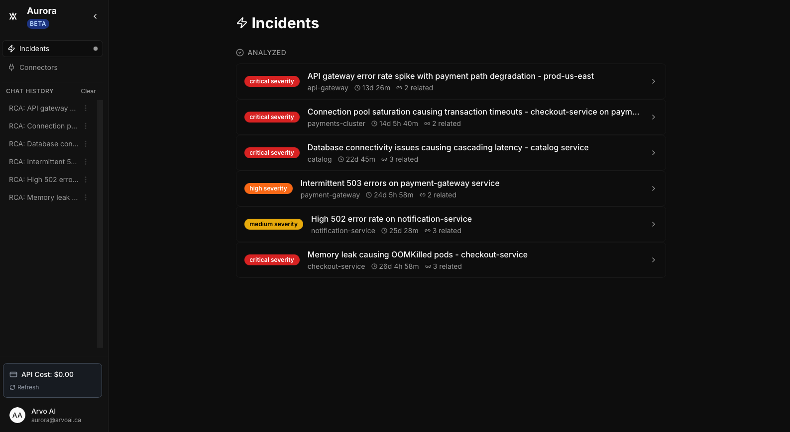
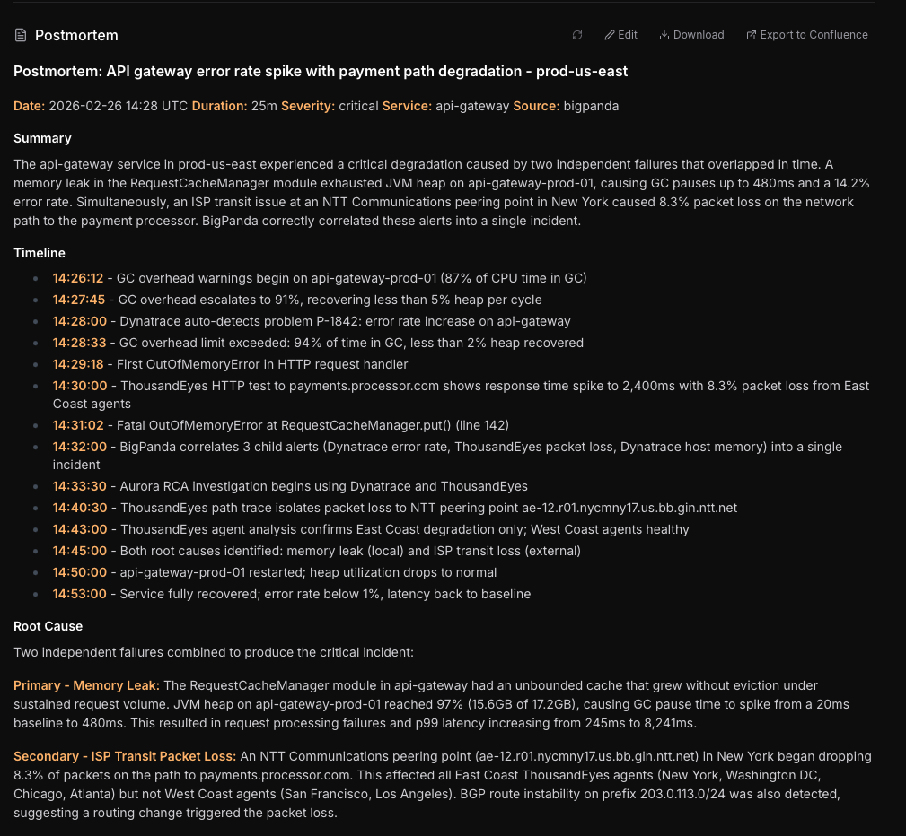
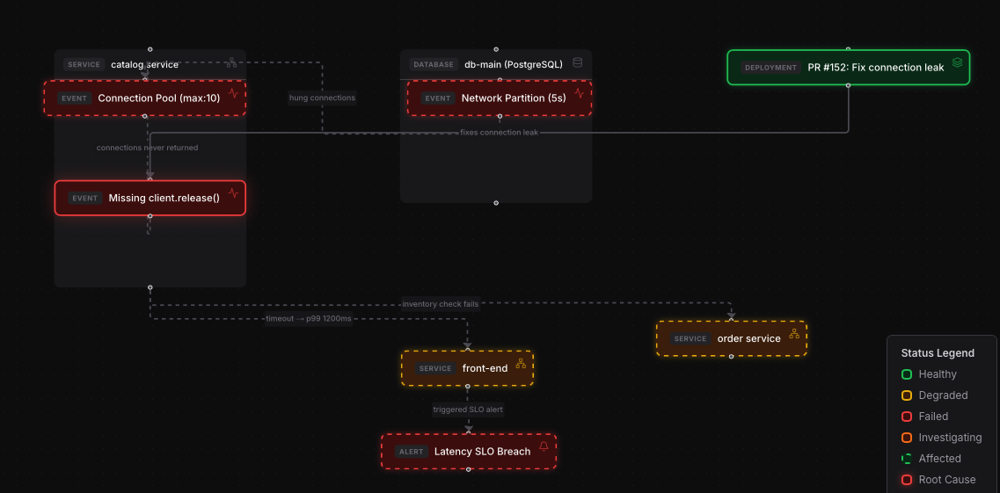
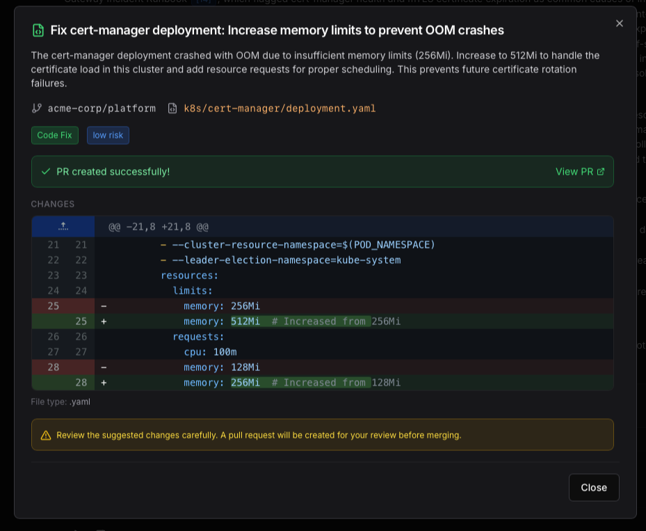

<p align="center">
  
</p>

<h1 align="center">Aurora</h1>

<p align="center">
  <strong>Open source AI agent for automated incident investigation & root cause analysis</strong>
</p>

<p align="center">
  <a href="https://github.com/Arvo-AI/aurora/stargazers"></a>
  <a href="https://github.com/Arvo-AI/aurora/releases"></a>
  <a href="https://github.com/Arvo-AI/aurora/blob/main/LICENSE"></a>
  <a href="https://github.com/Arvo-AI/aurora/actions/workflows/publish-images.yml"></a>
  <a href="https://github.com/Arvo-AI/aurora/network/members"></a>
  <a href="https://discord.gg/9vkXrTc4"></a>
</p>

<p align="center">
  <a href="#features">Features</a> &middot;
  <a href="#how-it-works">How It Works</a> &middot;
  <a href="#integrations">Integrations</a> &middot;
  <a href="#quick-start">Quick Start</a> &middot;
  <a href="https://arvo-ai.github.io/aurora/">Docs</a> &middot;
  <a href="https://www.arvoai.ca">Website</a> &middot;
  <a href="https://discord.gg/9vkXrTc4">Discord</a> &middot;
  <a href="https://cal.com/arvo-ai">Book a Demo</a>
</p>

---

### What's New

- **AI-Suggested Code Fixes** — Aurora can now generate pull requests with remediation code
- **Infrastructure Knowledge Graph** — Memgraph-powered dependency mapping across all cloud providers
- **Postmortem Export** — One-click export to Confluence with full timeline and root cause
- **OVH & Scaleway Support** — New cloud connectors for European providers

See the full [CHANGELOG](CHANGELOG.md) for all releases.

---

Aurora is an open-source (Apache 2.0) AI-powered incident management platform for SRE teams. When a monitoring tool fires an alert, Aurora's LangGraph-orchestrated AI agents **autonomously investigate** the incident — querying infrastructure across AWS, Azure, GCP, OVH, Scaleway, and Kubernetes, correlating data from 22+ tools, and delivering a structured root cause analysis with remediation recommendations.

Unlike traditional tools that automate workflows (Slack channels, paging, runbooks), Aurora automates the **investigation itself**.

<p align="center">
  
  <br />
  <a href="https://www.loom.com/share/8082df350ea64a928f7fadbf811c5138"><strong>Watch the full demo video</strong></a>
</p>

<p align="center">
  
</p>

## Features

### Agentic AI Investigation

Aurora's AI agents dynamically select from 30+ tools to investigate incidents. They run `kubectl`, `aws`, `az`, and `gcloud` commands in **sandboxed Kubernetes pods**, query logs, check recent deployments, and correlate data across systems — all autonomously.

<p align="center">
  
</p>

### Incident Dashboard

Track all incidents in a single dashboard. Aurora ingests alerts from PagerDuty, Datadog, Grafana, and other monitoring tools via webhooks, automatically triggering background investigations.

<p align="center">
  
</p>

### Automated Postmortem Generation

Aurora generates detailed postmortem reports with timeline, root cause, impact assessment, and remediation steps. Export directly to Confluence.

<p align="center">
  
</p>

### Infrastructure Knowledge Graph

Visualize your entire infrastructure as a dependency graph powered by Memgraph. When an incident occurs, Aurora traces the blast radius across services and cloud providers.

<p align="center">
  
</p>

### AI-Suggested Code Fixes

Aurora doesn't just find the root cause — it suggests code fixes and can generate pull requests with the remediation.

<p align="center">
  
</p>

### Additional Capabilities

- **Knowledge Base RAG** — Weaviate-powered vector search over your runbooks, past postmortems, and documentation
- **Multi-Cloud Native** — AWS (STS AssumeRole), Azure (Service Principal), GCP (OAuth), OVH, Scaleway, Kubernetes
- **Any LLM Provider** — OpenAI, Anthropic, Google, or local models via Ollama for air-gapped deployments
- **Terraform/IaC Analysis** — Understands your infrastructure-as-code state
- **Self-Hosted** — Docker Compose or Helm chart. HashiCorp Vault for secrets management
- **Free Forever** — No per-seat or per-incident pricing. Apache 2.0.

## Why Aurora?

| | Aurora | Rootly | FireHydrant | incident.io | HolmesGPT |
|---|:---:|:---:|:---:|:---:|:---:|
| **Approach** | Agentic investigation | Workflow + AI agents | Workflow automation | Workflow + AI agents | Agentic investigation |
| **AI Root Cause Analysis** | Autonomous multi-step | Autonomous multi-step | Post-incident summaries | Autonomous multi-agent | Autonomous agentic loop |
| **Cloud Providers** | AWS, Azure, GCP, OVH, Scaleway | Not specified | Not specified | Not specified | AWS, Azure, GCP |
| **CLI Execution** | Sandboxed K8s pods | No | No | No | Bash + kubectl |
| **Knowledge Base (RAG)** | Weaviate vector search | Past incidents | No | Past incidents | Confluence, Slab, Notion |
| **Infrastructure Graph** | Memgraph dependency map | No | Service Catalog | No | No |
| **Open Source** | Apache 2.0 | No | No | No | Apache 2.0 (CNCF) |
| **Self-Hosted** | Docker / Helm | No | No | No | Kubernetes / CLI |
| **LLM Provider** | Any (incl. Ollama) | Multi-provider (BYOK) | Undisclosed | Undisclosed | Any (12+ providers) |
| **Auto Postmortem** | Yes + Confluence export | Yes | Yes | Yes | Not verified |
| **Code Fix PRs** | Yes | Not verified | No | Yes | Yes |
| **Pricing** | **Free** (self-hosted) | From $20/user/mo | From $9,600/yr | From $15/user/mo | Free (open source) |

> Data verified from official websites and repositories as of March 2026. See sources: [rootly.com](https://rootly.com), [firehydrant.com](https://firehydrant.com), [incident.io](https://incident.io), [holmesgpt.dev](https://holmesgpt.dev)

## How It Works

```
Alert fires (PagerDuty, Datadog, Grafana, etc.)
        │
        ▼
   Aurora receives webhook
        │
        ▼
   AI agent selects tools (from 30+)
        │
        ├── Queries cloud APIs (AWS, Azure, GCP)
        ├── Runs CLI commands in sandboxed pods
        ├── Checks Kubernetes cluster status
        ├── Searches knowledge base (RAG)
        └── Traverses infrastructure dependency graph
                │
                ▼
   Root Cause Analysis generated
        │
        ├── Structured RCA with timeline
        ├── Impact assessment & blast radius
        ├── Remediation recommendations
        ├── Code fix suggestions (with PRs)
        └── Postmortem exported to Confluence
```

## Integrations

Aurora integrates with 22+ tools across your stack:

| Category | Tools |
|----------|-------|
| **Monitoring** | PagerDuty, Datadog, Grafana, Netdata, Dynatrace, Coroot, ThousandEyes, BigPanda |
| **Cloud Providers** | AWS, Azure, GCP, OVH, Scaleway |
| **Infrastructure** | Kubernetes, Terraform, Docker |
| **Communication** | Slack |
| **Code & Docs** | GitHub, Bitbucket, Confluence |
| **Search** | Self-hosted SearXNG |
| **Data Stores** | Memgraph (graph), Weaviate (vector), PostgreSQL |
| **Secrets** | HashiCorp Vault |

### Supported LLM Providers

| Provider | Models |
|----------|--------|
| **OpenAI** | GPT-4o, GPT-4, GPT-3.5 |
| **Anthropic** | Claude 4, Claude 3.5 Sonnet |
| **Google** | Gemini Pro, Gemini Flash |
| **OpenRouter** | Any model via OpenRouter API |
| **Ollama** | Llama, Mistral, and any local model (air-gapped) |

## Quick Start

```bash
# 1. Clone the repository
git clone https://github.com/arvo-ai/aurora.git
cd aurora

# 2. Initialize configuration
make init

# 3. Add your LLM API key
nano .env  # Add OPENROUTER_API_KEY=sk-or-v1-...

# 4. Start Aurora
make prod-prebuilt

# 5. Get Vault token and add to .env
docker logs vault-init 2>&1 | grep "Root Token:"
nano .env  # Add VAULT_TOKEN=hvs.xxx...

# 6. Restart to load Vault token
make down && make prod-prebuilt
```

Open **http://localhost:3000** in your browser. The first user to register becomes admin.

> **Note**: Aurora works without any cloud provider accounts. The LLM API key is the only external requirement. Connectors are optional.

### Pin a specific version

```bash
make prod-prebuilt VERSION=v1.2.3
```

### Build from source

```bash
make prod-local
```

### Deploy on Kubernetes

```bash
helm install aurora ./helm/aurora
```

For detailed deployment guides, see the **[Documentation](https://arvo-ai.github.io/aurora/)**.

## Architecture

| Component | Technology |
|-----------|-----------|
| **Backend** | Python, Flask, Celery, LangGraph |
| **Frontend** | Next.js |
| **Graph Database** | Memgraph |
| **Vector Store** | Weaviate |
| **Secrets** | HashiCorp Vault |
| **Storage** | PostgreSQL, Redis, SeaweedFS |

```
aurora/
├── server/      # Python API, chatbot, Celery workers
├── client/      # Next.js frontend
├── config/      # Configuration files
├── deploy/      # Deployment scripts
├── scripts/     # Utility scripts
└── website/     # Documentation (Docusaurus)
```

## Security & Roles

Aurora uses **Casbin RBAC** with three roles enforced at both the API and UI layers:

| Role | Capabilities |
|------|-------------|
| **Admin** | Full access — manage users, org settings, LLM config, connectors, incidents, chat |
| **Editor** | Write access — connectors, SSH keys, VMs, knowledge base, incidents, chat |
| **Viewer** | Read-only — view incidents, postmortems, dashboards, chat |

- Registration is closed after the first (admin) user. New accounts are created by admins only.
- Backend RBAC via `@require_permission` decorators on all write endpoints.
- CORS restricted to `FRONTEND_URL` — no wildcard origins.

For more details, see [SECURITY.md](SECURITY.md).

## Data Privacy

Aurora is fully self-hosted — **your incident data never leaves your environment**.

- All data stays on your infrastructure (Docker Compose or Kubernetes)
- No telemetry or usage data sent to Arvo AI
- Secrets stored in HashiCorp Vault with encryption at rest
- LLM API calls go directly from your infrastructure to your chosen provider
- Run fully air-gapped with local models via Ollama — zero external network calls
- RBAC enforced at both API and UI layers

## Community

We'd love your help making Aurora better.

- **[Discord](https://discord.gg/9vkXrTc4)** — Ask questions, share feedback, get help
- **[GitHub Issues](https://github.com/Arvo-AI/aurora/issues)** — Report bugs or request features
- **[GitHub Discussions](https://github.com/Arvo-AI/aurora/discussions)** — General discussion and ideas
- **[Book a Demo](https://cal.com/arvo-ai)** — See Aurora in action with our team
- **[Website](https://www.arvoai.ca)** — Learn more about Arvo AI
- **[Documentation](https://arvo-ai.github.io/aurora/)** — Full deployment and configuration guides
- **[Blog](https://www.arvoai.ca/blog)** — Guides on incident management, RCA, and SRE best practices

## Contributing

We welcome contributions! See [CONTRIBUTING.md](CONTRIBUTING.md) for guidelines.

Please read our [Code of Conduct](CODE_OF_CONDUCT.md) before participating.

## License

Apache License 2.0. See [LICENSE](LICENSE).

---

<p align="center">
  <strong>If Aurora helps your team, give us a <a href="https://github.com/Arvo-AI/aurora">star on GitHub</a>!</strong>
</p>
