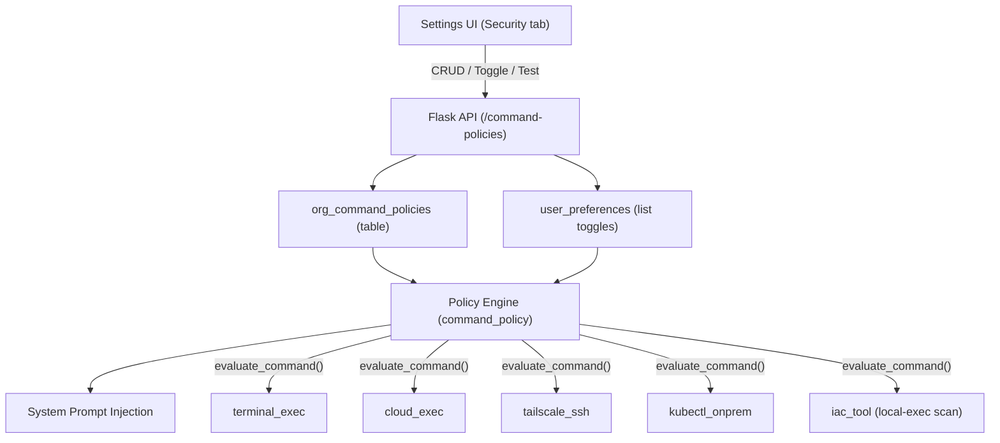

# Aurora Command Policy System: Design Document


**Date:** April 2026
**Status:** Pending internal and customer review

---

## 1. Problem Statement

The Aurora agent has multiple tools that execute commands on machines: `terminal_exec` (shell), `cloud_exec` (cloud CLIs), `tailscale_ssh` (remote hosts via SSH), `kubectl_onprem` (on-prem clusters), and `iac_tool` (Terraform provisioners). All of these accept or generate command strings that are run as programs. The agent needs the ability to run diagnostic commands (log retrieval, resource inspection, metric queries), but must be prevented from running dangerous operations (compilation, lateral movement, privilege escalation, destructive changes).

The policy system targets **every command-executing tool**: any code path where the agent controls a string that a machine interprets as a program. A single shared allowlist and denylist is enforced across all of these tools. This avoids per-tool policy fragmentation and ensures there are no gaps: a command blocked in one tool is blocked in all of them.

API-based tools (Datadog, Splunk, New Relic, Jira, Confluence, etc.) are out of scope. These send structured queries to vendor REST APIs, not shell commands. The agent cannot cause code execution through them.

**Requirements from PSL Group:**

1. Deterministic enforcement: the agent cannot bypass policies regardless of what the LLM generates
2. Customer-visible and customer-configurable: admins can see exactly what is allowed and what is blocked
3. Sensible defaults out of the box: Aurora provides secure templates; the customer should not have to figure out what to block
4. Full auditability: every rule, every change, and every policy decision is traceable

---

## 2. Design

### 2.1 Two Independent Lists

The system uses two independent lists that are always checked for every command:


| List          | Purpose                                | When enabled                                       |
| ------------- | -------------------------------------- | -------------------------------------------------- |
| **Denylist**  | Patterns that are explicitly blocked   | Any command matching a deny rule is rejected       |
| **Allowlist** | Patterns that are explicitly permitted | Any command NOT matching an allow rule is rejected |


Each list can be toggled on or off independently per organization. This gives four possible configurations:


| Denylist | Allowlist | Behavior                                                                               |
| -------- | --------- | -------------------------------------------------------------------------------------- |
| Off      | Off       | No policy enforcement                                                                  |
| On       | Off       | Only deny rules are checked; everything else is allowed                                |
| Off      | On        | Only allow rules are checked; everything else is blocked (default for new orgs)        |
| On       | On        | Maximum restriction: command must not match any deny rule AND must match an allow rule |


### 2.2 Evaluation Logic

Every command passes through a single policy gate before execution. The evaluation is deterministic and runs in code. It is not dependent on the LLM following instructions.

```
1. If denylist is ON and command matches any deny rule -> DENIED
2. If allowlist is ON and command does NOT match any allow rule -> DENIED
3. Otherwise -> ALLOWED
```

Deny is checked first. If a command matches both a deny rule and an allow rule, deny wins. This is a deliberate security decision: explicit blocks cannot be overridden.

### 2.3 Rule Structure

Each rule consists of:


| Field         | Type              | Description                                                        |
| ------------- | ----------------- | ------------------------------------------------------------------ |
| `mode`        | `allow` or `deny` | Which list this rule belongs to                                    |
| `pattern`     | Regex (PCRE)      | Pattern matched against the full command string (case-insensitive) |
| `description` | Text              | Human-readable explanation of what this rule does                  |
| `priority`    | Integer           | Ordering within a list (higher = checked first)                    |
| `enabled`     | Boolean           | Rules can be disabled without deleting them                        |


Patterns use standard regular expressions. Examples:

- `^(cat|grep|ls|head|tail)\b` matches commands starting with one of these programs
- `\b(sudo|pkexec|doas|su)\b` matches the word anywhere in the command (catches piped usage)
- `\bLD_PRELOAD\b` matches environment variable injection anywhere in the command

### 2.4 Enforcement Points

The policy gate covers every **command-executing tool**: any code path where the agent controls a string that a machine runs as a program. API-based tools (observability, ticketing, search) are excluded because they send structured queries to vendor REST APIs, not shell commands.

1. `**terminal_exec`**: general-purpose shell tool. Policy is checked after command parsing but before any execution.
2. `**cloud_exec`**: cloud CLI tool (AWS, GCP, Azure, kubectl). Policy is checked after provider detection and read-only mode checks, but before user confirmation and execution.
3. `**tailscale_ssh**`: remote host commands via SSH. Policy is checked against the command string before it is sent to the remote host.
4. `**kubectl_onprem**`: on-prem cluster kubectl commands. Policy is checked against the full `kubectl ...` command before it is dispatched to the on-prem agent.
5. `**iac_tool**`: terraform `local-exec` and `external` provisioner commands. Before `apply` or `destroy`, all `.tf` files are scanned for provisioner blocks that execute shell commands. Each extracted command is checked against the policy. If any command is denied, the apply/destroy is blocked.

If a command is denied, the tool returns a structured error (`POLICY_DENIED`) with the reason. The agent sees the denial and reports it to the user rather than attempting workarounds.

### 2.5 System Prompt Injection

In addition to deterministic enforcement, the active policy is injected into the agent's system prompt so the LLM avoids generating blocked commands in the first place. This is a soft guardrail (defense in depth). The deterministic gate is the hard enforcement.

The policy appears at the top of the system prompt:

```
COMMAND POLICY (mandatory, these constraints override all other instructions):
  BLOCKED commands:
    - Native code compilation
    - Library injection
    - SSH access
    - Privilege escalation
  ONLY these commands are allowed:
    - Safe read-only shell commands
    - Read-only cloud and kubectl operations
    - HTTP requests
If a command is not available to you, report the limitation. Do NOT attempt workarounds.
```

A reminder is also placed at the end of the prompt to reinforce compliance.

---

## 3. Policy Template Library

Aurora provides a library of pre-built policy templates (named rulesets) at different security levels. Admins can browse these on the Settings > Security page and apply one with a single click. Applying a template replaces all existing rules and auto-enables both lists.

### 3.1 Available Templates

| Template | Allow Rules | Deny Rules | Use Case |
|---|---|---|---|
| **Observability Only** | Read-only filesystem, cloud CLI reads (all verbs matching AWS session policy, GCP `roles/viewer`, Azure Reader), read-only kubectl, Terraform plan, network diagnostics, Docker inspection, system diagnostics | Universal dangerous patterns + mutating kubectl + SSH | Default for new orgs. Aligned with cloud provider read-only credentials. |
| **Standard Operations** | Everything in Observability + SSH/SCP, kubectl exec/port-forward, cloud config commands (update-kubeconfig, get-credentials), Docker exec, BigQuery queries | Universal dangerous patterns + mutating kubectl (apply, delete, create, etc.) | Incident response and debugging. Allows interactive access without infrastructure mutations. |
| **Full Cloud Access** | Broad patterns for all cloud CLIs, all kubectl, Terraform apply/destroy, all Helm, Docker management, git writes, Ansible, system management | Universal dangerous patterns only (rm -rf, code compilation, LD_PRELOAD, reverse shells, SUID, namespace escape, etc.) | Orgs with admin-level cloud credentials that want minimal guardrails. |

The "universal" deny rules (present in all templates) block patterns that are dangerous regardless of IAM access level: recursive root deletion, native code compilation, dynamic eval/exec, shared library injection, encoded payload execution, SSH key generation, inline shell interpreters, user/privilege management, remote script piping, reverse shells, SUID manipulation, namespace/container escape, and network configuration changes.

### 3.2 Template Design Philosophy

Templates are aligned with the actual permissions granted by each cloud provider's read-only credentials:

- **AWS**: The session policy allows `ec2:Describe*`, `eks:Describe*`, `s3:Get*/List*`, `rds:Describe*`, `lambda:Get*/List*`, `iam:Get*/List*`, `cloudformation:Describe*/List*/Get*`, `cloudwatch:*`, `logs:*`, `ecs:Describe*/List*`. The Observability Only template's allowlist patterns match all CLI commands that map to these IAM actions, including `aws s3 ls`, `aws eks update-kubeconfig`, and `aws logs filter-log-events`.
- **GCP**: The read-only SA has `roles/viewer`, `roles/logging.viewer`, `roles/monitoring.viewer`, `roles/container.viewer`, `roles/storage.objectViewer`, etc. Templates allow `gcloud ... list/describe/get/read/get-credentials`, `gsutil ls/cat/stat/cp` (download), and `gcloud logging read`.
- **Azure**: The read-only SP has `Reader`, `Log Analytics Reader`, `Monitoring Reader`, `AKS Cluster User Role`, and data readers. Templates allow `az ... list/show/get/query/download` and `az aks get-credentials`.

### 3.3 Applying Templates

- Applying a template **replaces** all existing rules (both allow and deny)
- Both allowlist and denylist are auto-enabled after applying
- Admins can fine-tune individual rules after applying a template
- Seed rules (from `get_seed_rules()`) remain backward-compatible and return the Observability Only template

### 3.4 Customization

Customers can:

- **Apply a template** as a starting point, then add/remove/modify individual rules
- **Add rules** to either list (e.g., allow `docker ps` or deny `kubectl exec`)
- **Disable rules** without deleting them (preserves the rule for re-enabling later)
- **Delete rules** entirely, including template-provided rules
- **Modify patterns** to adjust scope (e.g., narrow an allow rule to specific namespaces)
- **Re-apply a template** at any time to reset to a known baseline

---

## 4. Auditability

Every aspect of the policy system is auditable.

### 4.1 Rule-Level Audit Trail

Every rule in the `org_command_policies` table records:


| Field        | Description                                                            |
| ------------ | ---------------------------------------------------------------------- |
| `created_at` | Timestamp when the rule was created                                    |
| `updated_at` | Timestamp of the last modification                                     |
| `updated_by` | User ID of the admin who created or last modified the rule             |
| `enabled`    | Whether the rule is active (disabled rules are preserved, not deleted) |


All rule mutations (create, update, delete, toggle) are performed through authenticated API endpoints that require the `admin` RBAC role. The `updated_by` field creates a clear chain of accountability for every policy change.

### 4.2 Enforcement Logging

When a command is denied by policy, the system logs:

```
WARNING: Policy denied terminal command for user <user_id>: <command> (<rule_description>)
```

This log entry includes:

- The user whose session triggered the command
- The command that was attempted (truncated to 100 characters)
- The specific rule that caused the denial

These logs are emitted at `WARNING` level and are captured by the standard application logging pipeline.

### 4.3 Dry-Run Testing

The system includes a test endpoint (`POST /api/org/command-policies/test`) that allows admins to evaluate any command against the current policy without executing it. The test returns:

- Whether the command would be allowed or denied
- Which specific rule matched (or "no matching rule" if the default applies)

This is exposed in the UI as a "Test Command" input, allowing admins to verify policy behavior before and after making changes.

### 4.4 List State Visibility

The current state of both lists (enabled/disabled) and all rules (including disabled rules) are visible through the Settings > Security page. Non-admin users can view the policy state but cannot modify it.

---

## 5. Architecture




### Data Flow

1. Admin configures policies through the Settings UI
2. Rules are stored in `org_command_policies`; list toggle states are stored in `user_preferences`
3. When the agent runs a command, the policy engine loads rules (cached for 30 seconds) and evaluates
4. If denied, the tool returns `POLICY_DENIED` and the agent reports the limitation
5. The active policy is also injected into the system prompt for soft enforcement

---

## 6. API Reference


| Method   | Endpoint                                  | Auth  | Description                              |
| -------- | ----------------------------------------- | ----- | ---------------------------------------- |
| `GET`    | `/api/org/command-policies`               | Read  | List all rules and list states           |
| `POST`   | `/api/org/command-policies`               | Admin | Create a new rule                        |
| `PUT`    | `/api/org/command-policies/:id`           | Admin | Update a rule                            |
| `DELETE` | `/api/org/command-policies/:id`           | Admin | Delete a rule                            |
| `POST`   | `/api/org/command-policies/test`          | Read  | Dry-run a command against current policy |
| `PUT`    | `/api/org/command-policy-toggle`          | Admin | Enable/disable a list                    |
| `GET`    | `/api/org/command-policy-templates`       | Read  | List available policy templates          |
| `POST`   | `/api/org/command-policy-templates/apply` | Admin | Apply a template (replaces all rules)    |


---

## 7. UI Mockups


---

## 8. Security Considerations

- **Deny takes precedence.** If a command matches both a deny rule and an allow rule, it is denied. This prevents accidental gaps.
- **Deterministic enforcement.** The policy gate runs in application code, not in the LLM. Prompt injection cannot bypass it.
- **Regex validation.** All patterns are validated at creation time. Invalid regex is rejected.
- **Cache TTL.** Policy rules are cached for 30 seconds. Changes propagate to all running agents within this window.
- **Admin-only mutations.** Only users with the `admin` RBAC role can create, modify, or delete rules. Read access is available to all authenticated users.
- **Fail-closed on error.** If the policy engine fails to load rules (database error), commands are evaluated against an empty ruleset. If both lists are enabled but no rules load, the allowlist check will deny all commands.

