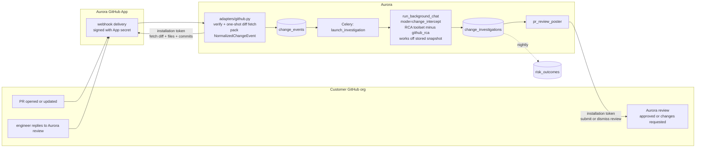

# Phase 1a — PR Gate (Change-Intercept Investigation Pipeline)

Aurora-owned GitHub App that assesses risk of staged changes at PR time. Every PR gets an LLM investigation; Aurora posts a **GitHub PR Review** (approve or request-changes) with risk rationale. Advisory posture: customers are told not to configure Aurora as a required reviewer in Phase 1a. The adapter abstraction is designed for future git hosts (GitLab, Bitbucket) even though only the GitHub App ships in Phase 1a.

This is Phase 1a of the overarching change-intercept system. See [change-intercept-phases.md](change-intercept-phases.md) for the full phase map (1a, 1b, Phase 2) and how this fits alongside the cloud resource-index diff (Phase 1b) and runtime signals (Phase 2).

## Why this exists

Google SRE's postmortem corpus attributes 37% of outages to binary pushes and 31% to configuration pushes — 68% combined, all change-induced ([SRE Workbook Appendix C](https://sre.google/workbook/postmortem-analysis/)). Aurora has an incident RCA engine but no pipeline that assesses the risk of changes *before* they become incidents. Phase 1a builds that pipeline as a PR-time gate: every staged PR gets an LLM-driven risk assessment, and Aurora reviews the PR — approving it or requesting changes with cited rationale.

Full literature backing at [change-induced-incidents-literature-review.md](change-induced-incidents-literature-review.md).

## Connectivity model — GitHub is a thin edge, investigation stays in Aurora

GitHub's role is intentionally narrow:

- **GitHub to Aurora (inbound)**: webhook events only. `pull_request` (PR opened/synchronize/reopened), `issue_comment` and `pull_request_review_comment` (replies to Aurora's reviews), `installation` / `installation_repositories` (lifecycle).
- **Aurora to GitHub (outbound)**: two operations — (1) a one-shot fetch of PR diff + changed files + commits at webhook-receive time using the installation token, and (2) review submission / dismissal via the reviews API when a verdict lands. That's it.

**The investigation itself never reaches back to GitHub.** Everything the `run_background_chat(mode='change_intercept')` call needs — PR diff, PR body, commits, linked tickets — is fetched once at webhook time and stored on the `change_events` row. The investigator works off that stored snapshot plus Aurora's own data stores: Memgraph topology, Weaviate `incident_feedback` (postmortems), Datadog for current service health, `jenkins_rca` for recent deploys. The RCA toolset passed to the investigator in `change_intercept` mode has `github_rca` filtered out so there's no accidental callback path.

**Ingest endpoint wiring**: the webhook endpoint `POST /webhooks/change-intercept/github` follows the exact pattern Aurora already uses for external webhooks — added to `_OPEN_PREFIXES` in [server/main_compute.py](server/main_compute.py) (see the existing entries for `/jenkins/webhook/`, `/datadog/webhook/`, etc. around L205-217) so GitHub's un-authenticated request bypasses Aurora's internal auth. HMAC verification via `X-Hub-Signature-256` is the GitHub equivalent of the `X-Aurora-Signature` pattern at [server/utils/web/webhook_signature.py](server/utils/web/webhook_signature.py); we extend that module with a `verify_github_signature()` helper (same `hmac.compare_digest` shape, different header and `sha256=` prefix stripping).

**Outbound auth**: App-level auth, not per-user OAuth. Aurora holds the App's private key, signs a short-lived JWT for App identity, exchanges it for a 1-hour installation access token scoped to a specific customer install, and uses that token for the diff fetch and review submission. The review appears on the PR as posted by the Aurora App (App avatar, App display name) — distinct from Aurora's existing per-user GitHub OAuth integration in [server/routes/github/github.py](server/routes/github/github.py), which is unchanged.

## Gate shape — triggers and surface

**Primary trigger**: PR opened or updated on a repo where the Aurora GitHub App is installed. GitHub sends `pull_request` events (`opened`, `synchronize`, `reopened`) to the App's webhook URL.

**Secondary trigger (reply-to-Aurora)**: an engineer replies to Aurora's review — either via a threaded reply on Aurora's review comment, or a top-level PR comment that `@`-mentions the App. This fires `pull_request_review_comment` or `issue_comment`. The webhook handler filters to replies specifically addressed to Aurora (see "Reply handling" below); unrelated PR chatter does not re-trigger. A follow-up investigation runs with the engineer's comment as additional context, the prior verdict as "your previous assessment," and produces an updated review that replaces Aurora's earlier one.

**Why only PRs, not CI runs or IaC applies**: the gate fires *before merge*. At synd.io, all Terraform changes go through PRs ("yes they go through github" — other dev, Apr 30 iMessage), so the PR is both the code-change surface and the IaC-change surface. A `workflow_run` trigger would fire *after merge* when the apply is already running; that's past the point of intercepting.

**Surface**: a **GitHub PR Review** submitted by the Aurora GitHub App, appearing in the PR's Reviewers sidebar alongside human reviewers. Two possible states:
- `APPROVED` — Aurora found nothing concerning. No review body (or a minimal one-liner).
- `CHANGES_REQUESTED` — Aurora assessed this change as high risk. Review body contains the rationale and cited findings.

**Advisory posture (Phase 1a)**: customers are instructed not to add Aurora as a required reviewer in their branch protection rules. A `CHANGES_REQUESTED` review from Aurora will surface as a red X on the PR but will not block merge. This keeps blast radius tight while we learn verdict quality. Revisiting the advisory stance requires outcome data.

Out of Phase 1a (covered by Phase 1b or Phase 2): monitor edits, runtime config changes via SaaS UIs, traffic shifts, out-of-band CLI edits, security/IAM console changes, laptop `terraform apply`, OS/dependency auto-updates. See [change-intercept-phases.md](change-intercept-phases.md) for Phase 1b (cloud resource-index diff) which covers console/CLI infrastructure changes.

## Aurora GitHub App

Aurora publishes a GitHub App. Each customer installs it on their org (or specific repos). The App is the sole integration point — receiving webhooks, authenticating API calls back to GitHub, and submitting PR reviews.

**Install flow** for a customer:
1. Aurora sends them an install link.
2. They click install, pick repos (all or specific), review permissions, confirm.
3. GitHub fires `installation.created` to our webhook endpoint; we persist `installation_id` tied to their `org_id`.
4. Done. All future PR events on enrolled repos flow to Aurora automatically.

**App scopes**:
- Webhook subscriptions: `pull_request`, `issue_comment`, `pull_request_review_comment`, `installation`, `installation_repositories`.
- Read: Contents (for the one-shot diff fetch at webhook time), Pull Requests (for PR body / commits / comments), Metadata.
- Write: **Pull Requests** (for submitting reviews and dismissing prior ones).

No `Checks: write` (Check Runs are not used). No `Contents: write` (Aurora never modifies code). No `Issues: write` (Aurora never opens issues).

**Distribution**: private (single-tenant-per-install) to start. Synd.io is the first install. Flipping to public marketplace listing is a GitHub setting change later, once the App is battle-tested.

## Architecture



The only two moments Aurora talks to GitHub outbound: (1) the diff fetch inside the adapter right after webhook verification, and (2) review submission / dismissal after a verdict lands.

**Review lifecycle**:
1. Webhook arrives. Adapter verifies the signature, then calls its own `fetch_snapshot` to pull diff + changed-files list + commits + PR body + comments via the installation token, packs all of it into the `NormalizedChangeEvent` + `ChangeSnapshot`, and writes the `change_events` row.
2. Celery picks up on the `change_intercept` queue. Optionally, the poster leaves a lightweight interim comment ("Aurora is investigating this PR") so the engineer sees the review is in flight.
3. Investigator runs against the stored snapshot plus Aurora's internal data sources. No callbacks to the vendor.
4. When the verdict lands, the core calls `adapter.post_verdict(event, investigation)`. For GitHub that translates to `POST /pulls/{n}/reviews` with `event=APPROVE` or `event=REQUEST_CHANGES`; the returned review id is stored on `change_investigations.external_verdict_id`.
5. On a re-run (PR update `synchronize`, or an engineer reply to Aurora), the core calls `adapter.dismiss_prior(event, prior_verdict_id)` followed by `adapter.post_verdict(event, new_investigation)`. For GitHub that's `PUT /pulls/{n}/reviews/{id}/dismissals` followed by a new review submission.

## Reply handling

Reply classification is vendor-specific and lives behind `adapter.is_reply_to_us(request)`. For GitHub, that method matches when any of the following hold:

- **Threaded reply**: `pull_request_review_comment` with `in_reply_to_id` pointing at a comment authored by Aurora (`user.type == 'Bot'` and `user.login == '<aurora-app-slug>[bot]'`).
- **At-mention**: `issue_comment` whose body contains `@<aurora-app-slug>`.
- **Author self-filter**: events where `sender.login` is Aurora's own App user are rejected (Aurora never re-triggers on its own comments).

If the adapter returns a `ReplyMatch`, the core handler:
1. Looks up the most recent `change_investigations` row for that change (via `change_events.dedup_key`).
2. Creates a new `change_events` row of `kind='code_change_followup'` referencing the same change's latest state, or reuses the original event depending on whether commits have changed since.
3. Enqueues a follow-up investigation. The prompt variant includes the engineer's comment verbatim, the prior verdict and rationale, and instructs the investigator to confirm or revise with citations.
4. After verdict, calls `adapter.dismiss_prior()` then `adapter.post_verdict()` with the new investigation.

**Thrash guard**: if an engineer keeps replying, cap at N follow-ups per change (configurable, start at 5). Beyond that, post a static "Aurora has investigated this conversation multiple times; please escalate to a human reviewer if disagreement persists" comment and stop re-triggering until a new commit arrives. The cap lives in the core, not the adapter.

## Vendor neutrality — the ChangeAdapter protocol

The GitHub App is the only *implemented* ingestion path in Phase 1, but the adapter protocol is shaped to support GitLab, Bitbucket, Terraform Cloud, and similar platforms without changes to the core (schema, router, Celery tasks, investigator, validator). Each new vendor is a new adapter file plus a registry entry — real work (~1-2 weeks per adapter for the App/OAuth setup, webhook signature flavor, fetch APIs, reply semantics, post-verdict quirks), but the core never changes.

`ChangeAdapter` protocol (six methods, lives at `server/services/change_intercept/adapters/base.py`):

```python
class ChangeAdapter(Protocol):
    vendor: str

    def verify_signature(self, request) -> bool: ...
    def parse(self, request) -> NormalizedChangeEvent | None: ...
    def fetch_snapshot(self, event: NormalizedChangeEvent) -> ChangeSnapshot: ...
    def is_reply_to_us(self, request) -> ReplyMatch | None: ...
    def post_verdict(self, event, investigation) -> str: ...  # returns vendor-native verdict id
    def dismiss_prior(self, event, prior_verdict_id: str) -> None: ...
```

Everything vendor-specific — webhook signature flavor, "what counts as a reply to Aurora," "how do I express request_changes on this platform" — lives behind these methods. The vendor-neutral core never special-cases by vendor.

**What each method covers, and how the three major platforms differ:**

- `verify_signature` — GitHub uses HMAC-SHA256 via `X-Hub-Signature-256`; GitLab uses a pre-shared token via `X-Gitlab-Token`; Bitbucket uses a webhook secret header or IP allowlist.
- `parse` — vendor-specific payload shape → `NormalizedChangeEvent`. GitHub `pull_request` / GitLab `Merge Request Hook` / Bitbucket `pullrequest:created`.
- `fetch_snapshot` — one-shot fetch of diff + files + commits + body at webhook time, using vendor-native auth (GitHub installation token, GitLab PAT or App OAuth, Bitbucket App Password or OAuth). Returns a `ChangeSnapshot` dataclass the core persists onto `change_events`.
- `is_reply_to_us` — classifies comment/note events as reply-to-Aurora or not. GitHub: `user.type == 'Bot'` and `in_reply_to_id` or `@`-mention. GitLab: service-account username match or mention in note body. Bitbucket: `parent.id` chain or UUID mention. Returns the matched prior investigation id on match, `None` otherwise.
- `post_verdict` — translates Aurora's binary verdict into the platform's idiom. GitHub: `POST /pulls/{n}/reviews` with `event=APPROVE` or `event=REQUEST_CHANGES`. GitLab: `approve` endpoint or `unapprove + post MR note` (GitLab has no native "request changes" state). Bitbucket: `POST /pullrequests/{id}/approve` or `POST /pullrequests/{id}/request-changes`. Returns the vendor-native id so the core can store it for future dismissal.
- `dismiss_prior` — removes Aurora's prior verdict on a re-run (PR update or reply follow-up). GitHub: `PUT /pulls/{n}/reviews/{id}/dismissals`. GitLab: `unapprove` or edit/delete the prior note. Bitbucket: `DELETE /pullrequests/{id}/request-changes`.

**What's in the neutral core (unchanged across vendors):**

- `NormalizedChangeEvent` and `ChangeSnapshot` dataclasses.
- `change_events` / `change_investigations` / `risk_outcomes` schema — no vendor-specific columns. `change_investigations.external_verdict_id` holds whatever `post_verdict` returned.
- `POST /webhooks/change-intercept/<vendor>` route and adapter-registry dispatch.
- Celery queue, `process_change_event` / `launch_investigation` / `post_verdict` tasks.
- `run_background_chat(mode='change_intercept')` with `github_rca` filtered out (the filter generalizes to "filter any tool that makes outbound calls to the vendor of the change being investigated" when more adapters land; for Phase 1 it's hardcoded since only GitHub exists).
- `verdict_validator`.
- Prompt builder (renders the `ChangeSnapshot` agnostic of vendor).

**Install-lifecycle handling is per-adapter.** Each vendor has a different install/OAuth model (GitHub App install flow, GitLab group-level OAuth, Bitbucket workspace App Password, etc.). File layout reflects this: `server/routes/change_intercept/github_install_events.py` is GitHub-specific. A future GitLab adapter would add `gitlab_install_events.py` alongside it.

## Investigator design

Reuses [server/chat/background/task.py](server/chat/background/task.py)::`run_background_chat` in a new `mode='change_intercept'`. Differences vs. incident RCA:

- **Input**: a stored snapshot — the `change_events` row pre-populated by the adapter. The prompt renders, at minimum:
  - Full unified diff and changed-files list (already fetched and persisted).
  - **PR body verbatim** as "engineer's stated reason." First-class signal.
  - Commit messages in the PR (often explain intent beyond the body).
  - Linked ticket URLs parsed from body / branch / commit messages.
  - Target repo, branch, target env (inferred from branch / file paths), actor.
  - For follow-up investigations: prior verdict + rationale + engineer's reply comment.
- **Prompt framing** (initial): *"This PR is staged. Assess the risk of merging it. A PR should only be flagged as high risk if you find concrete evidence it could disrupt production. Compare what the diff actually does against the engineer's stated reason — flag mismatches. Cite specific findings from your tool calls."*
- **Prompt framing** (follow-up): the above, plus *"You previously rendered verdict X with rationale Y. The engineer has replied: '...'. Re-evaluate with this new context. You may confirm or revise your verdict; either way, cite evidence."*
- **Toolset**: the existing Aurora RCA toolset with `github_rca` **filtered out** — the investigator must not call back to GitHub during the run. Available tools: `datadog_tool` for current service health, Memgraph topology, `incident_feedback` vector search over past postmortems, `jenkins_rca` for recent deploys ([server/chat/backend/agent/tools/cloud_tools.py:1271-1291](server/chat/backend/agent/tools/cloud_tools.py)), and any other non-GitHub RCA tools already registered. All PR / diff context the investigator could have pulled from `github_rca` is already in the stored snapshot.
- **Budget**: no hard cap. Prompt gives soft guidance (*"aim for a concise investigation — typically ~15 tool calls is sufficient; investigate as deeply as the change warrants"*). The LLM decides when it's done.
- **Read-only posture**: enforced by prompt instruction, not allowlist. Same "tell and trust" model the incident investigator already uses.

**Output** (binary verdict, enforced by `verdict_validator.py`):

```
{
  "verdict": "approve" | "request_changes",
  "rationale": "1-3 sentences",
  "intent_alignment": "matches" | "partial" | "mismatch",
  "intent_notes": "short note if partial/mismatch, else null",
  "cited_findings": [{"tool": "...", "call_id": "...", "summary": "..."}]
}
```

**Citation rule**: `request_changes` requires at least one entry in `cited_findings` referencing a real tool call from the transcript. Otherwise the validator downgrades to `approve` (with `intent_notes` preserved for the review body) and logs the violation. Rationale: we would rather under-block than cry wolf in the first weeks of advisory reviews.

**Intent alignment**: surfaces whether the diff actually does what the PR body says it does. Inspired by the other dev's Terraform bot pattern from the Apr 30 iMessage screenshot. Does not gate the verdict directly — the investigator decides whether a mismatch is severe enough to request changes. When present (`partial` or `mismatch`), it's rendered as a dedicated section of the review body, whether the overall verdict is approve or request-changes.

## Review body shape

When `verdict='request_changes'`, the review body follows a fixed template so engineers can skim quickly:

```
**Aurora assessed this change as high risk.**

{rationale}

{if intent_alignment != matches: "**Intent check:** {intent_notes}"}

**Findings cited:**
- {tool}: {summary}
- {tool}: {summary}

_Aurora is an advisory reviewer. Dismiss this review to merge anyway._
```

When `verdict='approve'`, the review is submitted with either an empty body or, if `intent_alignment != matches`, a short note flagging the intent discrepancy without blocking.

## Data model

```sql
CREATE TABLE github_app_installations (
  installation_id BIGINT PRIMARY KEY,
  org_id VARCHAR(255) NOT NULL,
  github_account_login TEXT NOT NULL,
  repos JSONB NOT NULL,
  installed_at TIMESTAMPTZ DEFAULT now(),
  suspended_at TIMESTAMPTZ,
  UNIQUE (org_id, github_account_login)
);

CREATE TABLE change_events (
  id UUID PRIMARY KEY DEFAULT gen_random_uuid(),
  org_id VARCHAR(255) NOT NULL,
  vendor VARCHAR(32) NOT NULL,
  kind VARCHAR(32) NOT NULL,              -- 'code_change' | 'code_change_followup'
  external_id TEXT NOT NULL,
  dedup_key TEXT NOT NULL,
  repo TEXT,
  ref TEXT,
  commit_sha TEXT,
  actor TEXT,
  target_env VARCHAR(32),
  change_body TEXT,                       -- PR / MR description (vendor-neutral name)
  change_diff TEXT,                       -- unified diff fetched at webhook time
  change_files JSONB,                     -- [{path, status, additions, deletions}, ...]
  change_commits JSONB,                   -- commit messages for intent signal
  follow_up_comment TEXT,                 -- for code_change_followup: engineer's reply verbatim
  payload JSONB NOT NULL,                 -- raw webhook body (audit)
  received_at TIMESTAMPTZ DEFAULT now(),
  UNIQUE (org_id, vendor, external_id, commit_sha, kind),
  UNIQUE (org_id, dedup_key, kind)
);

CREATE TABLE change_investigations (
  id UUID PRIMARY KEY DEFAULT gen_random_uuid(),
  change_event_id UUID REFERENCES change_events(id) ON DELETE CASCADE,
  parent_investigation_id UUID REFERENCES change_investigations(id),  -- follow-ups point to the investigation they revise
  verdict VARCHAR(16) NOT NULL,           -- 'approve' | 'request_changes'
  rationale TEXT NOT NULL,
  intent_alignment VARCHAR(16),           -- 'matches' | 'partial' | 'mismatch'
  intent_notes TEXT,
  cited_findings JSONB NOT NULL,
  tool_calls JSONB NOT NULL,
  tool_call_count INT NOT NULL,
  duration_ms INT NOT NULL,
  llm_model TEXT NOT NULL,
  external_verdict_id TEXT,               -- vendor-native id returned by post_verdict (GitHub review id, GitLab note id, etc.)
  investigated_at TIMESTAMPTZ DEFAULT now()
);

CREATE TABLE risk_outcomes (
  change_investigation_id UUID PRIMARY KEY REFERENCES change_investigations(id),
  caused_incident_id UUID REFERENCES incidents(id),
  feedback_source VARCHAR(32),
  labeled_at TIMESTAMPTZ DEFAULT now()
);
```

## Files to create

**Vendor-neutral core:**
- `server/services/change_intercept/__init__.py`
- `server/services/change_intercept/adapters/__init__.py`
- `server/services/change_intercept/adapters/base.py` — `NormalizedChangeEvent` dataclass and `ChangeAdapter` protocol.
- `server/services/change_intercept/adapters/registry.py` — vendor-string to adapter mapping. Phase 1: just `'github'`.
- `server/services/change_intercept/verdict_validator.py` — validates investigator output; enforces the binary verdict enum and citation rule.

**GitHub App specifics:**
- `server/services/change_intercept/github_app.py` — JWT signing with App private key, installation-token exchange, short-lived token cache per `installation_id`.
- `server/services/change_intercept/adapters/github.py` — implements all six `ChangeAdapter` methods for GitHub:
  - `verify_signature` via `X-Hub-Signature-256`.
  - `parse` for `pull_request` events (opened, synchronize, reopened).
  - `fetch_snapshot`: uses `github_app.py` to fetch PR unified diff + files + commits + comments via the installation token.
  - `is_reply_to_us` for `issue_comment` / `pull_request_review_comment` (Bot-user match, `in_reply_to_id`, at-mention, sender self-filter).
  - `post_verdict`: `POST /pulls/{n}/reviews` with `event=APPROVE` or `event=REQUEST_CHANGES`; renders rationale/intent/findings body for rejections.
  - `dismiss_prior`: `PUT /pulls/{n}/reviews/{id}/dismissals`.

**Ingest route and Celery:**
- `server/routes/change_intercept/__init__.py`
- `server/routes/change_intercept/webhook.py` — single endpoint `POST /webhooks/change-intercept/<vendor>`. Dispatches to the adapter from the registry; core logic (persist event, enqueue investigation, handle replies) is vendor-agnostic. Must be added to `_OPEN_PREFIXES` in [server/main_compute.py](server/main_compute.py) (follows pattern at L205-217) so GitHub's unauthenticated request is accepted.
- `server/routes/change_intercept/github_install_events.py` — GitHub-specific: handles `installation.created` / `installation.deleted` / `installation_repositories` to maintain `github_app_installations`. Named explicitly per-vendor so that a future GitLab adapter adds `gitlab_install_events.py` alongside without collision.
- `server/routes/change_intercept/tasks.py` — Celery: `process_change_event`, `launch_investigation`, `launch_followup_investigation`, `post_verdict` (calls `adapter.post_verdict` / `adapter.dismiss_prior`).

Register the blueprint at [server/main_compute.py](server/main_compute.py) alongside the existing webhook blueprints.

## Files to modify

- [server/utils/db/db_utils.py](server/utils/db/db_utils.py) — add `github_app_installations`, `change_events` (with `change_body` / `change_diff` / `change_files` / `change_commits` / `follow_up_comment`), `change_investigations` (with `parent_investigation_id` and `external_verdict_id`), `risk_outcomes` to `create_tables`.
- [server/utils/web/webhook_signature.py](server/utils/web/webhook_signature.py) — add `verify_github_signature()` that handles the `sha256=` prefix and the `X-Hub-Signature-256` header. (Future vendor adapters add their own signature helpers here or alongside.)
- [server/chat/background/task.py](server/chat/background/task.py) — add `mode='change_intercept'` to `run_background_chat`. RCA toolset is passed with any tool that reaches out to the change's vendor filtered out (Phase 1: `github_rca` hardcoded-filtered since GitHub is the only vendor); no budget enforcement.
- [server/chat/background/rca_prompt_builder.py](server/chat/background/rca_prompt_builder.py) — add `build_change_intercept_prompt(change_event, prior_investigation=None)`. Renders the stored snapshot (`change_diff`, `change_files`, `change_body`, `change_commits`), linked ticket URLs, repo, branch, actor, target env — all vendor-neutral. When `prior_investigation` is set, renders the follow-up variant including prior verdict and engineer's reply. Includes binary-verdict instruction, soft depth guidance, and read-only posture.
- [server/celery_config.py](server/celery_config.py) — add a `change_intercept` queue and a nightly beat entry for the linker.
- [server/main_compute.py](server/main_compute.py) — register the `change_intercept` blueprint and add `/webhooks/change-intercept/` to `_OPEN_PREFIXES`.

## Calibration (John's rare-disease-test guidance, Apr 30)

Before enabling live reviews for any customer, run the investigator in dry-run mode against their last 100-200 historical PRs. This validates:

1. **Score distribution is not degenerate.** If the investigator flags 80% of PRs as high risk, it's useless — the customer will get alert fatigue and ignore Aurora. The distribution should have most PRs approved and a small tail of request-changes.
2. **Discrimination.** Even within a customer who ships risky changes frequently, Aurora must distinguish "this one is unusually risky" from "this is your normal level of risk." If the score is flat across all PRs regardless of content, the system isn't discriminating (John: "it would be better to just say there's no problem here").
3. **Baseline incident rate matters.** If the customer has incidents on 1 in 100 PRs and Aurora's accuracy isn't at least 99%, saying "no problem" on every PR would be more accurate than running the investigator. Calibration surfaces this before the customer sees it.

Operationally: use the GitHub App's installation token to fetch historical PRs, run the investigator in a batch Celery task, store results in `change_investigations` with a `dry_run=true` flag, review the distribution before flipping to live mode.

## Deferred from Phase 1a

- **Per-line review comments.** Phase 1a posts only a top-level review body. Per-hunk comments on specific lines of the diff are a later enhancement once the investigator reliably identifies specific files/lines as the risky ones.
- **Required-reviewer enforcement.** Phase 1a is advisory only. Customers are told not to add Aurora to branch protection. Moving to blocking-capable review requires outcome data.
- **Broad PR-comment ingestion.** Aurora only re-triggers on replies addressed to it (`@`-mention or threaded reply). Ingesting arbitrary PR discussion as context is out of scope.
- **Cloud resource-index drift detection.** Phase 1b — catches console/CLI/out-of-band infrastructure changes. See [synd.io/design/change-intercept-phases.md](synd.io/design/change-intercept-phases.md).
- **Runtime signal analysis.** Phase 2 — catches the ~30% non-change-induced incidents. See phase overview doc.
- **Additional git hosts**: GitLab, Bitbucket, Terraform Cloud. The six-method adapter protocol is designed to accommodate them — GitLab replaces GitHub's HMAC signature with `X-Gitlab-Token`, replaces `reviews` API with `approve`/`unapprove` + MR notes, replaces `in_reply_to_id` with note-thread `parent.id`; Bitbucket has native `approve` / `request-changes` endpoints and a different mention syntax. Each adapter is ~1-2 weeks of work (App/OAuth setup on the vendor side, fetch API integration, reply semantics, post-verdict quirks). Build only when a customer needs one.
- **Nightly linker** populating `risk_outcomes`: schema is in place; the linker itself is the last step of Phase 1a so it has real data to link.
- **Customer-configurable risk thresholds.** John's scorecard/threshold approach: let customers set a threshold for when Aurora should request changes vs. just note a concern. Deferred from initial launch but designed to be a config field on `github_app_installations`. Add after calibration data reveals what threshold ranges are useful.

## Rollout

1. **GitHub App + schema + webhook + adapter + investigator + review poster + reply handling.** Create the private GitHub App with the scopes above. Implement JWT + installation-token flow, webhook endpoint + install-lifecycle, adapter with one-shot diff fetch, `change_intercept` mode in `run_background_chat` with `github_rca` filtered out, reply filter + follow-up investigation path, review poster with dismiss-and-replace. **~3-3.5 weeks.**
2. **Calibration dry-run.** Synd.io installs the App. Run investigator against their last 100-200 historical PRs in dry-run mode. Review score distribution and discrimination. Adjust prompt/citation thresholds if needed. **~0.5 week.**
3. **Go live.** Enable live reviews. Every PR gets an Aurora review; replies to Aurora trigger follow-up investigations. Monitor false-positive rate closely in first two weeks.
4. **Nightly postmortem-to-investigation linker** populating `risk_outcomes`. **~0.5 week.**

Total Phase 1a: ~4-4.5 weeks from kickoff to live reviews with outcome labels accruing.

Phase 1b (cloud resource-index diff) follows after Phase 1a is stable. See [synd.io/design/change-intercept-phases.md](synd.io/design/change-intercept-phases.md).

## Open questions before step 1

1. **GitHub App ownership.** Who in Aurora creates the App (GitHub account, App ID, private key)? Recommend a shared Aurora ops account, not an individual's.
2. **App display name and avatar.** This is the name that appears in the Reviewers sidebar on every PR. "Aurora" vs. "Aurora Review" vs. something else — worth a quick decision since it's customer-visible.
3. **Secret storage** for the App's private key and webhook secret.
4. **Target env inference.** Cheapest heuristic: branch name (`main` / `master` / `prod-*` → prod; others → non-prod). Ship heuristic first; per-repo customer config later.
5. **PR-description standards.** Intent-alignment quality depends on PR body quality. Worth calibrating expectations with Emmanuel.
6. **Advisory messaging.** Onboarding docs must state clearly: "do not add Aurora as a required reviewer yet." Worth a short written note to include with the install link.

Worth a short alignment call with Emmanuel before step 1 to confirm App ownership, target-env inference, repo scope, and the advisory-reviewer expectation.